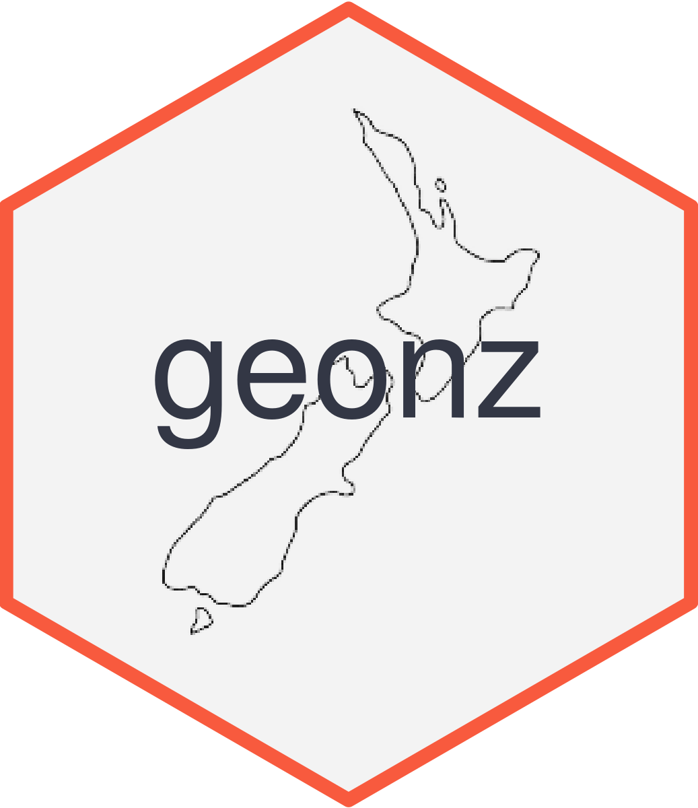

<!-- README.md is generated from README.Rmd. Please edit that file -->

```{r, include = FALSE}
knitr::opts_chunk$set(
  collapse = TRUE,
  comment = "#>",
  fig.path = "man/figures/README-",
  out.width = "100%"
)
```

# db.geonz <a href='https://gitlab.harmonic.co.nz/harmonic/databases/db-geonz'></a>

<!-- badges: start -->

[](https://gitlab.harmonic.co.nz/harmonic/databases/db-geonz/pipelines)

<!-- badges: end -->

## Overview

This package provides datasets of the annually released geographic area
boundaries of New Zealand. The datasets are stored as simple features data
tables.

Currently, the db-geonz package houses datasets for the boundaries for five
geographic area types as set at 1 January 2018: statistical area 1, statistical
area 2, ward, territorial authority and regional council. The package also
contains versions of these boundaries clipped to the coastline that can be used
for map creation/cartographic purposes.

This package is designed to be used with the __geonz__ package.

## Installation

To install this package from gitlab, you must first generate a Personal Access
Token; the package can then be installed using the `remotes` package:

``` r
remotes::install_gitlab(repo = 'harmonic/databases/db-geonz', auth_token = <PAT>, host = 'gitlab.harmonic.co.nz/')
```

Alternatively the `utilic` package can be used:

```r
utilic::install_harmonic('harmonic/databases/db-geonz')
```

In future, this package will be installed automatically when the __geonz__ package is installed.
